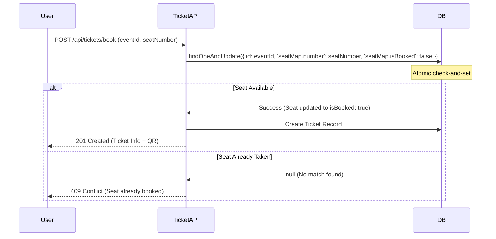

# API Reference & Endpoints

All EventX Studio backend APIs follow RESTful principles and return JSON responses.

**Base URL**: `/api`

> [!TIP]
> **Interactive Documentation**: A dynamic Swagger UI is available at `/api-docs` when running the server locally. It contains complete request/response schemas for core endpoints and allows for interactive API testing.

## 🌍 Public Endpoints

### Get All Events

`GET /api/public/events` or `GET /api/events`

- **Description**: Returns a paginated list of published events.
- **Query Params**:
  - `page`: Page number (default: 1)
  - `limit`: Events per page (default: 12)
  - `category`: Filter by event category
  - `search`: Search in title, description, and venue city.

---

## 🔐 Authentication (`/api/auth`)

### Register User

`POST /api/auth/register`

- **Body**:
  ```json
  {
    "name": "Mostafa Karam",
    "email": "user@example.com",
    "password": "StrongPassword123!",
    "role": "user"
  }
  ```
- **Response (201)**:
  ```json
  {
    "success": true,
    "message": "Registered successfully. Please verify your email.",
    "data": { "user": { "id": "...", "name": "...", "email": "..." } }
  }
  ```

### Login

`POST /api/auth/login`

- **Body**:
  ```json
  { "email": "user@example.com", "password": "StrongPassword123!" }
  ```
- **Response (200)**: Sets `accessToken` and `refreshToken` cookies.
  ```json
  {
    "success": true,
    "data": { "user": { ... }, "sessionInfo": { "device": "Linux", ... } }
  }
  ```

---

## 🎫 Ticket Management (`/api/tickets`)

### ⚡ Atomic Booking Flow



### Book a Ticket (Atomic)

`POST /api/tickets/book`

- **Headers**: Requires `x-csrf-token`.
- **Body**:
  ```json
  {
    "eventId": "EVT12345",
    "seatNumber": "S001",
    "paymentMethod": "credit_card",
    "transactionId": "TXN_7890",
    "paymentToken": "eyJhbG..."
  }
  ```
- **Response (201)**:
  ```json
  {
    "success": true,
    "message": "Ticket booked successfully",
    "data": { "ticket": { "ticketId": "...", "ticketNumber": "...", ... }, "qrCodeImage": "base64..." }
  }
  ```

### Cancel a Ticket
`PUT /api/tickets/:id/cancel`
- **Access**: User (owner) or Admin.
- **Description**: Atomic cancellation of a ticket. Refunds payment (simulated) and updates event analytics.
- **Response (200)**:
  ```json
  { "success": true, "message": "Ticket cancelled successfully", "data": { "ticket": { ... } } }
  ```

### Multi-Ticket Atomic Booking

`POST /api/tickets/book-multi`

- **Body**:
  ```json
  {
    "eventId": "EVT12345",
    "quantity": 3,
    "seatNumbers": ["S001", "S002", "S003"]
  }
  ```

---

## 📅 Event Management (`/api/events`)

### Create Event

`POST /api/events`

- **Access**: Organizer or Admin.
- **Body**:
  ```json
  {
    "title": "Annual Tech Conference",
    "description": "The biggest tech gathering...",
    "category": "conference",
    "date": "2026-05-20T10:00:00Z",
    "venue": {
      "name": "Main Hall",
      "address": "...",
      "city": "...",
      "capacity": 500
    },
    "seating": { "totalSeats": 500 },
    "pricing": { "type": "paid", "amount": 99.99, "currency": "USD" }
  }
  ```

### Cancel an Event (Atomic)
`PUT /api/events/:id/cancel`
- **Access**: Organizer (owner) or Admin.
- **Description**: Atomically cancels an event, voids all tickets, refunds payments, and notifies attendees.
- **Response (200)**:
  ```json
  { "success": true, "message": "Event has been cancelled and attendees notified." }
  ```

---

## 📊 Analytics (`/api/analytics`)

### Dashboard Overview

`GET /api/analytics/dashboard`

- **Access**: Admin.
- **Returns**: Real-time revenue, occupancy rates, categories, and recent activity logs.

---

## 🛡️ Global Response Format

### Success (2xx)

```json
{
  "success": true,
  "message": "Action completed",
  "data": { ... }
}
```

### Error (4xx, 5xx)

```json
{
  "success": false,
  "message": "Error description here",
  "errors": ["Validation error 1", "..."]
}
```

_Note: In production (`NODE_ENV=production`), generic messages are returned for raw server errors to prevent information leakage._
