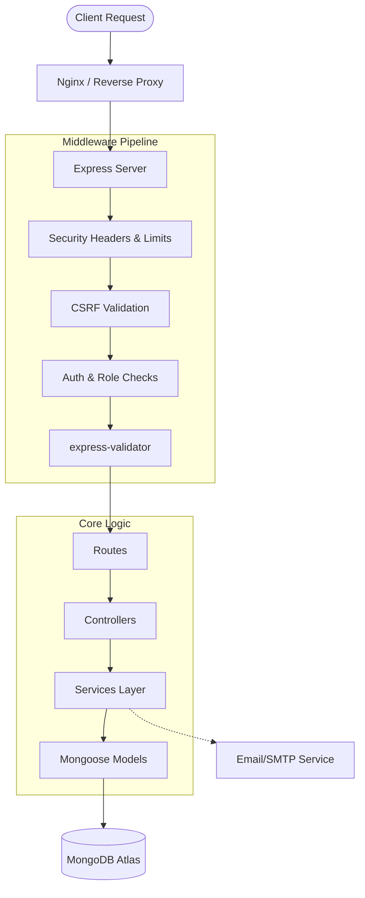

# Backend Architecture Deep Dive

The EventX Studio backend is built for reliability and security. This document details the technical patterns and data flow of the system.

## 🗺️ System Flowchart

## 🧱 The Core Pattern: Decoupled MVC

The system separates concerns into four distinct layers:

### 1. The Route Layer (`routes/`)

Routes are the entry points. They bind URLs (`/api/events`, `/api/auth/login`, etc.) and apply necessary **Middleware Guards**.

- **Validation**: Routes now use centralized `express-validator` middleware schemas (e.g., `createEventValidator`) found in `middleware/validators.js`.
- **Delegation**: They pass the validated request/response objects to the Controller.
- **Rule**: NO business logic or complex validation is allowed in route files.

### 2. The Controller Layer (`controllers/`)

Controllers bridge the gap between HTTP requests and the Services.

- **Request Handling**: They extract data from `req.body`, `req.query`, and `req.user`.
- **Response Formatting**: All controllers use a standard `{ success: true, message: '...', data: { ... } }` JSON format.
- **Delegation**: They invoke the corresponding Service class to perform database operations.

### 3. The Service Layer (`services/`)

The core business logic and database interactions reside here.

- **Encapsulation**: Classes like `authService.js` and `eventsService.js` handle complex tasks (e.g., user registration, event duplication) completely independent of the Express HTTP objects.
- **Reusability**: Functions in the service layer can be reused by different controllers or background jobs.

### 4. The Model Layer (`models/`)

Models encapsulate all persistent state and data-level logic.

- **Schema Enforcement**: Strict types, required fields, and enum validation.
- **Methods & Virtuals**: Complex calculations like `isLocked`, `bookSeat()`, and `cancelSeat()` are defined directly on the schema to ensure consistent behavior across all controllers.

### 5. The Middleware Layer (`middleware/`)

The security and processing pipeline.

- **`auth.js`**: Handles multi-source token extraction (Authorization headers OR httpOnly cookies), verifies JWTs, and enforces Role-Based Access Control (RBAC).
- **`errorMiddleware.js`**: A centralized "Catch-All" that converts MongoDB/Express errors into user-friendly JSON responses while logging the full stack trace to Winston for developers.

---

## 🔄 Detailed Request Lifecycle

When a client makes a request, it follows this exact sequence:

1. **Static Protections**: `helmet` adds security headers, `cors` verifies the origin.
2. **Request Parsing**: `express.json` (with a 10KB limit) parses the body.
3. **Global Rate Limiting**: The request is checked against the IP-based rate quota.
4. **Sanitization**: `mongo-sanitize` and `xss-clean` strip malicious payloads.
5. **CSRF Validation**: For state-mutating requests (POST, PUT), the `x-csrf-token` header is checked against the encrypted cookie.
6. **Authentication (Route Specific)**: The `authenticate` middleware verifies the JWT and attaches the `user` object to the `req`.
7. **Authorization (Route Specific)**: Role checks (`requireAdmin`, `requireOrganizer`) ensure the user has sufficient permissions.
8. **Controller Execution**: The core business logic runs.
9. **Global Error Boundary**: If an error is thrown, it is caught by the global handler to prevent server crashes.

---

## 🛡️ Atomic Concurrency Handling

One of the most critical parts of the architecture is the **Atomic Booking Engine**.

To prevent two users from booking the same seat:

1. We use MongoDB's atomic `findOneAndUpdate`.
2. The query includes a filter: `seatNumber: X` AND `isBooked: false`.
3. The update sets `isBooked: true` AND decrements `availableSeats`.
4. If the query finds no match (because the seat was booked by someone else in the millisecond prior), the operation returns `null`, and we safely inform the user the seat is gone.

This "Compare-and-Swap" pattern ensures data integrity without the overhead of heavy distributed locks.
