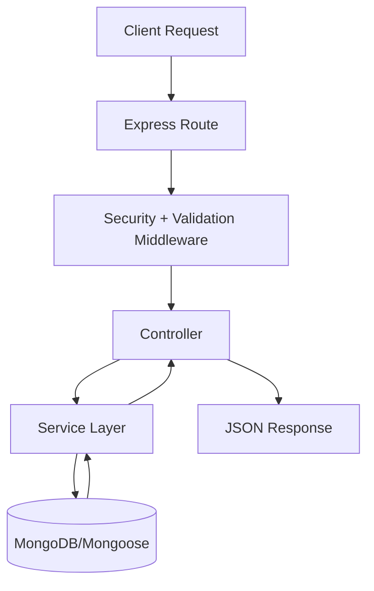

# Backend Architecture

Last updated: 2026-04-17

EventX Studio Backend uses a practical **Express + Mongoose + Services** architecture:

- `routes/` define URL contracts.
- `middleware/` enforces security/validation.
- `controllers/` remain thin HTTP adapters.
- `services/` own business rules and multi-collection orchestration.
- `models/` define persistence contracts and indexes.

## Request Lifecycle

## Security and Reliability Boundaries

- Security headers via strict `helmet` configuration.
- CSRF enforced on `/api` mutable requests.
- Rate limiting with Redis-backed store support and memory fallback.
- Global `405` method enforcement for unsupported methods on valid paths.
- Global error handler normalizes API errors and strips stacks in production.

## Data Consistency Model

- Seat booking uses atomic update patterns to prevent race-condition overbooking.
- Active single-booking integrity is enforced with database-level unique indexing.
- Critical multi-collection workflows use transactional retries through `utils/transaction.js`:
  - event cancellation lifecycle
  - event deletion cascade
- Safe fallback is used in local/test environments where transactions are unsupported.

## API Contract

- Success payloads: `{ success: true, data: ... }`
- Error payloads: `{ success: false, data: null, error, message }`
- Health endpoint: `GET /api/health`
- Swagger endpoint: `/api-docs` (non-production)
