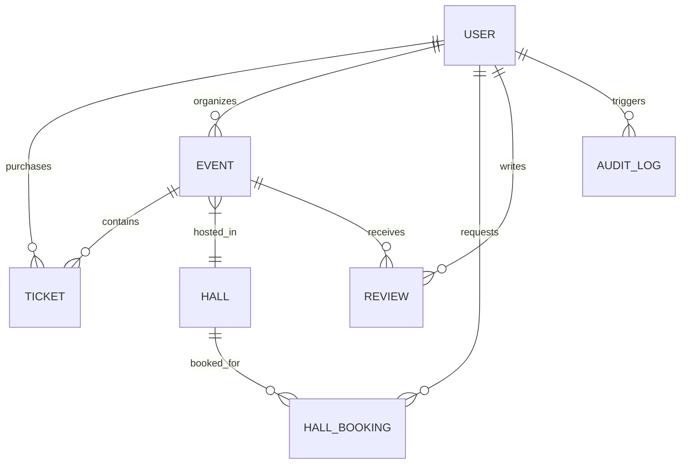

# Database Models & Schemas

The EventX Studio backend uses MongoDB with Mongoose to enforce strict data structures. This document defines the primary schemas and their internal logic.

## 🗺️ Entity Relationship Map

## 👤 User Model (`models/User.js`)

| Field            | Type    | Description            | Defaults / Rules                            |
| :--------------- | :------ | :--------------------- | :------------------------------------------ |
| `name`           | String  | User's full name       | Required, Max 50 chars                      |
| `email`          | String  | Unique email address   | Lowercase, unique index                     |
| `password`       | String  | Bcrypt hashed password | `select: false` by default                  |
| `role`           | String  | User permissions level | `user`, `organizer`, `admin`, `venue_admin` |
| `isActive`       | Boolean | Account status         | `true`                                      |
| `loginAttempts`  | Number  | Tracks failed logins   | Increments on failure                       |
| `lockUntil`      | Date    | Lockout expiration     | Set after 5 failures                        |
| `activeSessions` | Array   | Device & Session info  | Stores IP, OS, Browser                      |

### 🔒 Security Hooks:

- **`pre('save')`**: Automatically hashes the password using 12 salt rounds. It also maintains a `passwordHistory` (last 5 passwords) to prevent immediate reuse.
- **`comparePassword()`**: A convenience method to verify login attempts.

---

## 📅 Event Model (`models/Event.js`)

| Field      | Type   | Description            | Defaults / Rules                               |
| :--------- | :----- | :--------------------- | :--------------------------------------------- |
| `title`    | String | Event name             | Required, Max 100 chars                        |
| `category` | String | Event type             | Enum: `conference`, `workshop`, `sports`, etc. |
| `date`     | Date   | Start date/time        | Must be in the future                          |
| `status`   | String | Lifecycle state        | `draft`, `published`, `cancelled`              |
| `seating`  | Object | Seat management        | Includes `totalSeats` and `availableSeats`     |
| `seatMap`  | Array  | Recursive seat objects | Tracks `id`, `isBooked`, `bookedBy`            |
| `pricing`  | Object | Cost config            | `type`: `free\|paid`, `amount`: Number         |

### ⚡ Atomic Methods:

- **`bookSeat(seatNumber, userId)`**: Atomically marks a seat as booked and decrements availability.
- **`cancelSeat(seatNumber)`**: Frees a seat and increments availability.

---

## 🎫 Ticket Model (`models/Ticket.js`)

| Field      | Type   | Description          | Defaults / Rules                             |
| :--------- | :----- | :------------------- | :------------------------------------------- |
| `ticketId` | String | Unique friendly ID   | Prefixed `TKT-XXXXXXXX`                      |
| `status`   | String | Booking status       | `booked`, `used`, `cancelled`, `expired`     |
| `qrCode`   | String | Verification payload | JSON stringified ticket data                 |
| `payment`  | Object | Transaction records  | Includes `transactionId`, `amount`, `status` |
| `checkIn`  | Object | Check-in logs        | Tracks `isCheckedIn`, `time`, `actor`        |

---

## 📊 Database Indexing Strategy

To ensure high performance under load, the following compound and single indexes are implemented:

- **Users**: Unique index on `email`.
- **Events**:
  - `{ date: 1, status: 1 }`: For fast filtering on the public homepage.
  - `{ organizer: 1 }`: For the "My Events" dashboard.
- **Tickets**:
  - `{ event: 1, user: 1 }`: To prevent duplicate ticket purchases for the same event per user.
  - `{ status: 1, bookingDate: -1 }`: For administrative reporting.
- **AuditLogs**: `{ actor: 1, createdAt: -1 }`: To audit user activity efficiently.
