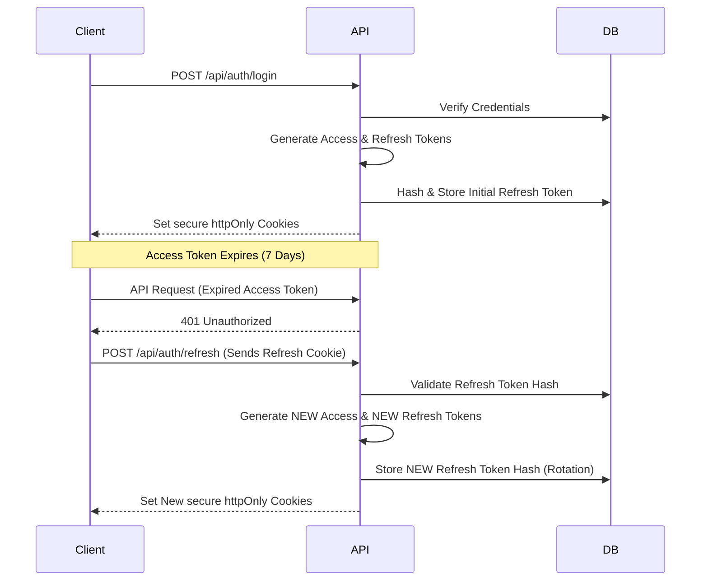

# Security Implementation Details

Security is a foundational pillar of EventX Studio. This document provides a technical deep dive into how we protect the platform.

## 🔑 Authentication Strategy (JWT + Cookies)

We use a "Double Token" system stored exclusively in `httpOnly` cookies:

1. **Access Token (`accessToken`)**:
   - **Expiration**: 7 days (Configurable via `JWT_EXPIRE`).
   - **Payload**: `id` (User ID), `sessionId` (for session tracking).
   - **Use**: Verification for all protected API calls.

2. **Refresh Token (`refreshToken`)**:
   - **Expiration**: 30 days.
   - **Payload**: `id` (User ID), `type: 'refresh'`.
   - **Storage**: A SHA-256 hash is stored securely in the `User` model.
   - **Rotation & Reuse Detection**: Every time a refresh token is used, a _new_ refresh token is issued (Token Rotation). If an old, already-used refresh token is presented, the system detects a potential replay attack and instantly revokes _all_ active sessions for that user.

### 🔄 Double Token Rotation Flow

### 🛡️ Cookie Protection:

Tokens are never stored in `localStorage` or `sessionStorage` (which are vulnerable to XSS).
Instead, we use:

- `httpOnly: true`: Prevents JavaScript from reading the cookie.
- `secure: true`: Ensures the cookie is only sent over HTTPS (in production).
- `sameSite: 'strict'`: Prevents CSRF by ensuring the cookie is sent only from our origin.

---

## 🛡️ CSRF Protection (Cross-Site Request Forgery)

We use the `csrf-csrf` library with a double-submit cookie pattern:

1. **Retrieval**: The client first calls `GET /api/auth/csrf-token`.
2. **Cookie + token**: The server sets the `__csrf` cookie and returns a CSRF token in the JSON body.
3. **Requirement**: Every POST, PUT, DELETE, or PATCH request must include the `x-csrf-token` header.
4. **Validation**: The server validates the header token against the cookie-backed CSRF mechanism. If validation fails, the request is rejected with an invalid CSRF token error.

---

## 🚦 Rate Limiting Tiers

To prevent brute-force and Denial-o-Service (DoS) attacks, we use `express-rate-limit`:

- **Global Tier**: 200 requests / 15 mins. Applied to all `/api` routes.
- **Auth Tier**: 15 requests / 15 mins. Applied specifically to `/api/auth/login` and `/api/auth/register`.
- **Upload Tier**: Stricter limits (5/min) specifically for file uploads to prevent storage exhaustion.

---

## 🧹 Sanitization & XSS Mitigation

1. **NoSQL Injection**: `mongo-sanitize` strips all `$` prefixed keys from `req.body` and `req.query`, preventing attackers from bypassing auth via queries like `{"email": {"$gt": ""}}`.
2. **XSS Protection**: `xss-clean` sanitizes all user-provided strings by stripping HTML tags and script fragments.
3. **Helmet JS**: Configured with strict `Content-Security-Policy` (CSP) directives to ensure only trusted assets are loaded.

---

## 🪵 Audit & Logging

Every administrative or sensitive action is recorded in the **Audit Logs**.

- **What is logged**: Actor ID, Action Name (e.g., `user.delete`), Target Resource, IP Address, and User-Agent.
- **Why**: This provides a non-repudiable trail for security investigations and simplifies troubleshooting for support staff.
