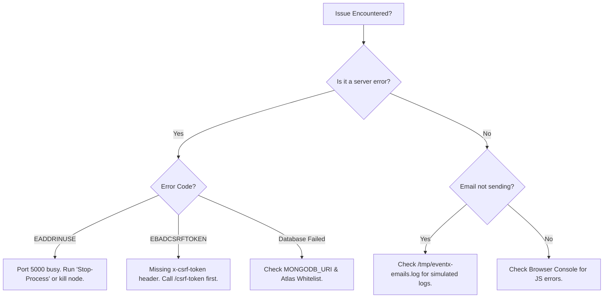

# Setup, Development & Deployment

This document provides a comprehensive guide to setting up and running the EventX Studio backend across different environments.

## 🛠️ Local Development Setup

1. **Install Dependencies**:

   ```bash
   cd backend
   npm install
   ```

2. **Configure Environment**:
   Duplicate `.env.example` as `.env` and fill in the required fields.

3. **Database**:
   Ensure you have a MongoDB instance running locally on port 27017 or provide a MongoDB Atlas URI in `.env`.

4. **Running**:
   - Development (with hot reload): `npm run dev`
   - Standard: `npm start`

5. **Database Seeding (Demo Users)**:
   - Run the seeder manually: `npm run seed`
   - Default users created:
     - Admin: `mostafa.karam.work@gmail.com` / `admin123`
     - Venue Admin: `venueadmin@eventx.com` / `password123`
     - Organizer: `organizer@eventx.com` / `password123`
     - User: `user@eventx.com` / `user1234`

6. **Testing**:
   - Run the integration test suite (via Jest & Supertest): `npm test`
   - _Note: Tests run against an isolated `mongodb-memory-server` and won't affect your local database._

---

## ⚙️ Environment Variables Reference

| Variable                    | Description                          | Default / Example                         |
| :-------------------------- | :----------------------------------- | :---------------------------------------- |
| `PORT`                      | The port the server listens on       | `5000`                                    |
| `NODE_ENV`                  | `development` or `production`        | `development`                             |
| `MONGODB_URI`               | MongoDB connection string            | `mongodb://localhost:27017/eventx-studio` |
| `JWT_SECRET`                | Secret key for access tokens         | Required (Strong string)                  |
| `JWT_REFRESH_SECRET`        | Secret key for refresh tokens        | `JWT_SECRET + "_refresh"`                 |
| `JWT_EXPIRE`                | Access token expiration (e.g., `7d`) | `7d`                                      |
| `FRONTEND_URL`              | The URL of your Vite app             | `http://localhost:5173`                   |
| `BACKEND_URL`               | The base URL of the server           | `http://localhost:5000`                   |
| `EMAIL_HOST`                | SMTP server host                     | (Logged to file if missing)               |
| `PAYMENT_SIMULATION_SECRET` | Secret for simulated payments        | `JWT_SECRET`                              |
| `CSRF_SECRET`               | Required secret for CSRF tokens      | (Must be set explicitly)                  |

---

## 🚀 Production Deployment Tips

### 1. Reverse Proxy (Nginx)

Always run the Node server behind a reverse proxy like Nginx. This allows you to handle SSL termination and serve static files efficiently.

#### Example Nginx Config:

```nginx
server {
    listen 80;
    server_name api.eventx.studio;

    location / {
        proxy_pass http://localhost:5000;
        proxy_http_version 1.1;
        proxy_set_header Upgrade $http_upgrade;
        proxy_set_header Connection 'upgrade';
        proxy_set_header Host $host;
        proxy_cache_bypass $http_upgrade;
    }
}
```

### 2. Process Manager (PM2)

Use PM2 to manage the Node process. It will automatically restart the server if it crashes.

```bash
npm install pm2 -g
pm2 start server.js --name "eventx-backend"
```

### 3. Body Limits & Compression

The server is configured with a 10kb body limit for JSON payloads to prevent "Large Payload" attacks. `compression` is used globally to reduce response sizes and improve latency.

---

## 🔍 Troubleshooting Guide



### 1. "EBADCSRFTOKEN" error

- **Cause**: The client is sending a POST/PUT request without a valid `x-csrf-token` header, or the CSRF cookie is missing.
- **Fix**: Ensure the frontend calls `GET /api/auth/csrf-token` before performing any mutating actions and includes the token in the headers.

### 2. "JWT Expired" on Login

- **Cause**: The system clock on the server or client is out of sync.
- **Fix**: Ensure your environment (Docker/VPS) is using NTP for clock synchronization.

### 3. "Database Connection Failed"

- **Cause**: Restricted IP access in MongoDB Atlas or incorrect credentials.
- **Fix**: Check your Atlas "Network Access" whitelist and verify the `MONGODB_URI` in `.env`.

### 4. Emails Not Sending

- **Cause**: Incorrect SMTP settings or missing `EMAIL_HOST`.
- **Fix**: In development, check the `/tmp/eventx-emails.log` file. In production, ensure `EMAIL_USER` and `EMAIL_PASS` (App Password) are correct.
